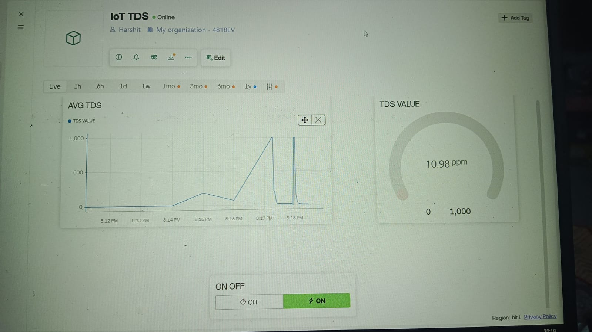

# 💧 IoT-Based Water Quality Monitoring System (TDS Monitoring)

This project showcases a smart and efficient **IoT-based Water Quality Monitoring System** that uses a **TDS (Total Dissolved Solids) sensor**, **ESP8266 NodeMCU**, and the **Blynk IoT platform** to provide **real-time monitoring** of water quality.

## 📌 Project Overview
The system measures TDS levels in water and sends the data wirelessly to a mobile app dashboard via Wi-Fi. It enables real-time tracking, mobile alerts when water quality is unsafe, and supports future expansion to other water parameters.
## 🔧 Hardware Components
- 🧠 **ESP8266 NodeMCU** – Wi-Fi enabled microcontroller
- 🌡️ **Gravity TDS Sensor** – Measures water’s total dissolved solids (in ppm)
- 🔌 Breadboard & Jumper Wires
- 📲 Smartphone with **Blynk IoT App**
## 🖥️ Software & Tools
- **Arduino IDE** – For writing and uploading code
- **Blynk IoT Platform** – For cloud-based real-time monitoring
- **ESP8266 Board Package** – Installed via Arduino Boards Manager
- **Blynk Libraries** – Added via Library Manager or ZIP
## ⚙️ Working Principle
1. The **TDS sensor** detects dissolved impurities in water by analyzing its electrical conductivity.
2. The **ESP8266 NodeMCU** reads this analog signal and converts it into TDS (ppm) values.
3. These values are sent in real-time to the **Blynk cloud**.
4. Data is visualized on the **Blynk mobile dashboard** as live graphs, gauges, and alerts
## 🖼️ Circuit Diagram

## 📲 Output Screenshot

## 🧪 Feature
- ✅ Real-time monitoring of water TDS (ppm)
- ✅ Mobile alerts if TDS exceeds safe levels
- ✅ Wireless data transmission via Wi-Fi
- ✅ Clean and intuitive dashboard (via Blynk)
- ✅ Scalable: add sensors for pH, turbidity, etc.
- ✅ Compact, portable, and cost-effective
## 📦 Installation & Setup
### 1. Arduino IDE Setup
- Install **ESP8266 Board** via Board Manager (`http://arduino.esp8266.com/stable/package_esp8266com_index.json`)
- Install Blynk Library (`Blynk`, `SimpleTimer`, etc.)
### 2. Circuit Connection
- TDS Sensor to A0 (Analog) on NodeMCU
- VCC to 3.3V  
- GND to GND
### 3. Blynk Configuration
- Create a new Blynk project (ESP8266 device type)
- Add:
  - Gauge Widget for TDS Value (Virtual Pin V1)
  - Graph Widget for Live Plotting
  - Notification or Email Widget for Alerts
- Get **Auth Token** and add it to your code
## 🧠 Learnings & Outcomes
- 📡 IoT communication using ESP8266
- ⚙️ Real-world sensor interfacing & calibration
- 📱 Cloud dashboard creation (Blynk)
- 🔄 Event-driven design & alert systems
- 🌱 Sustainable IoT for environmental applications
## 🚀 Future Scope
- 🔬 Add sensors for pH, turbidity, temperature
- ⚡ Integrate with solar power for off-grid use
- 🤖 Use AI for water quality prediction
- 🌐 Web-based dashboard for remote data access
## 📬 Connect With Us
We’d love to collaborate or hear feedback!  
Feel free to reach out on LinkedIn or GitHub!

